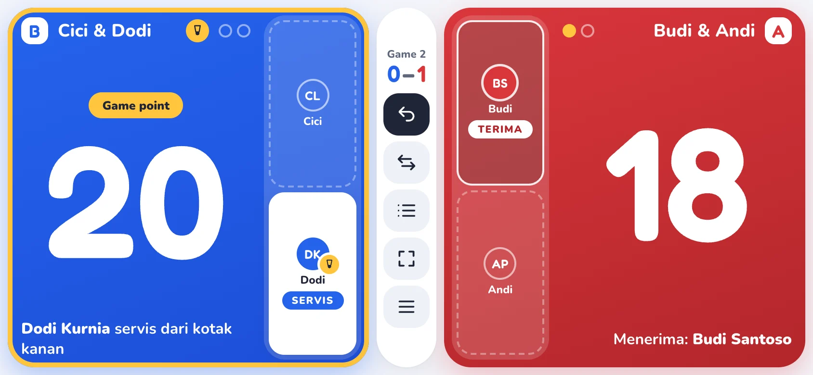
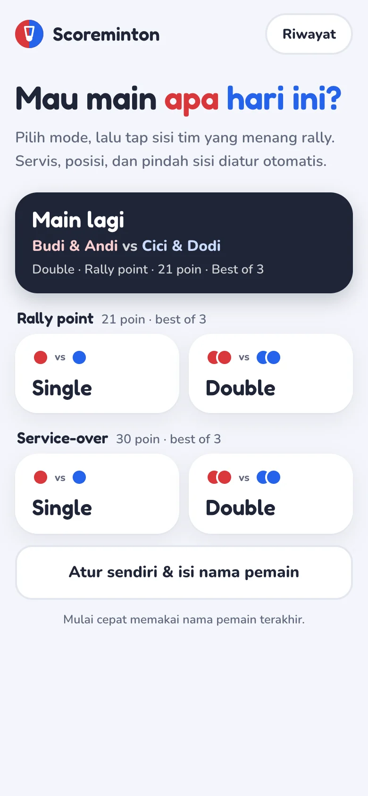
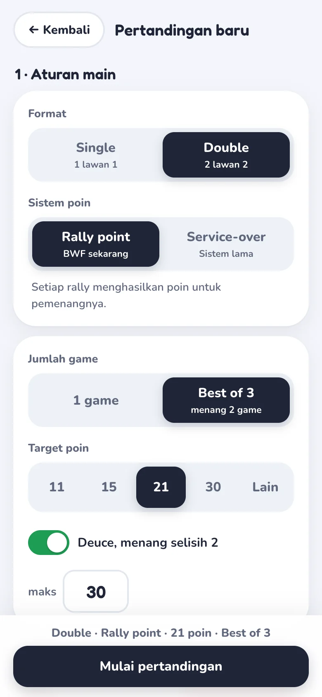
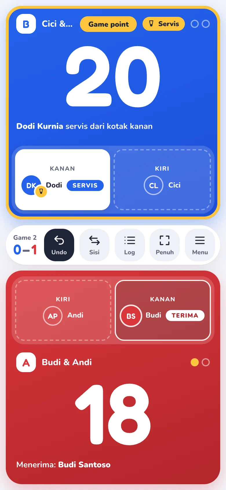
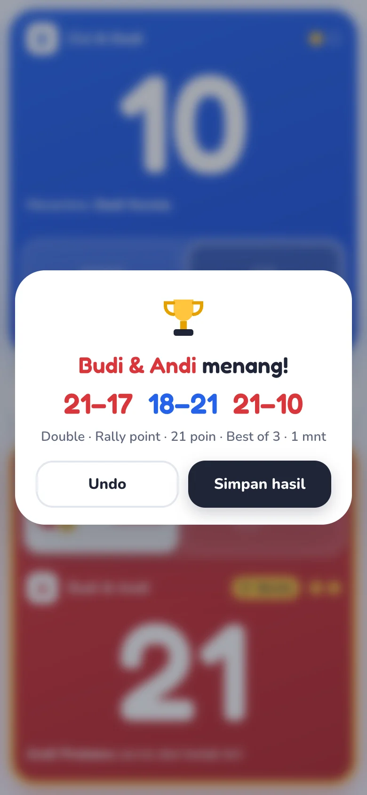

<p align="center">
  
</p>

<h1 align="center">Scoreminton</h1>

<p align="center">
  Papan skor badminton untuk pinggir lapangan.<br>
  Web app / PWA, mobile-first, landscape diutamakan, plus port native iOS (SwiftUI).
</p>

<p align="center">
  <a href="https://scoreminton.vercel.app"><b>Coba sekarang → scoreminton.vercel.app</b></a>
</p>

<p align="center">
  
</p>

Satu tap = satu rally. Siapa yang servis, dari kotak mana, siapa yang menerima, kapan interval, dan kapan pindah sisi diatur otomatis. Tanpa akun, tanpa iklan, tetap jalan offline.

## Tampilan

<table>
  <tr>
    <td align="center" width="25%"></td>
    <td align="center" width="25%"></td>
    <td align="center" width="25%"></td>
    <td align="center" width="25%"></td>
  </tr>
  <tr>
    <td align="center"><sub>Beranda</sub></td>
    <td align="center"><sub>Atur pertandingan</sub></td>
    <td align="center"><sub>Papan skor (portrait)</sub></td>
    <td align="center"><sub>Akhir pertandingan</sub></td>
  </tr>
</table>

## Fitur

- **Format** Single (1 lawan 1) dan Double (2 lawan 2)
- **Sistem poin** Rally point (BWF, 21 poin, deuce sampai 30) dan Service-over (sistem lama, 30 poin, setting sampai 32) — target, deuce/setting, dan batas maksimal bisa diubah (11 / 15 / 21 / 30 / custom)
- **Servis otomatis** kotak kanan/kiri, server & penerima, "one hand down" dan Server 1/2 di service-over ganda, diagram mini posisi pemain
- **Best of 1 / best of 3** dengan skor per game, interval di setengah target, pindah sisi antar game dan saat interval game penentu
- **Anti salah tap** poin dihitung saat jari diangkat (geser atau dua jari = batal), jeda anti double-tap, tukar sisi harus ditekan-tahan
- **Undo tanpa batas** dalam satu match, termasuk membatalkan akhir game; log rally per game
- **Indikator** Game point / Match point, Deuce / Setting, getar singkat tiap poin
- **Mulai cepat** 2×2 (Single/Double × Rally/Service-over) dan **Main lagi** dengan pengaturan terakhir
- **Resume** match aktif tersimpan otomatis; menutup browser tidak menghilangkan skor. Mulai match baru saat ada match berjalan selalu minta konfirmasi
- **Riwayat** hasil match (tanggal, durasi, skor per game, pemenang), bisa dihapus
- **Pinggir lapangan** layar tidak mati (Wake Lock), mode layar penuh, area sentuh ≥ 44 px, safe-area notch, keyboard/tablet
- **Aksesibel** skor diumumkan ke pembaca layar, fokus terkunci di dialog, kontras AA, mendukung *reduced motion*
- **PWA offline** installable, semua aset dan font di-cache, data hanya di perangkat

Spesifikasi lengkap dan aturan skor: [PRD.md](PRD.md).

## Mulai

Butuh Node.js 20.19+ atau 22.12+ (syarat Vite 8).

```bash
npm install
npm run dev
```

Buka http://localhost:5173. Untuk mencoba di HP pada jaringan Wi-Fi yang sama, jalankan `npm run dev -- --host` lalu buka alamat Network yang ditampilkan.

| Perintah | Fungsi |
|---|---|
| `npm run dev` | Dev server Vite dengan HMR |
| `npm test` | Unit test engine skor dan store (Vitest) |
| `npm run lint` | Lint (oxlint) |
| `npm run build` | Type-check + build produksi + service worker ke `dist/` |
| `npm run preview` | Sajikan hasil build secara lokal |

## Cara pakai

1. Di beranda pilih **Main lagi**, salah satu kartu **mulai cepat**, atau **Atur sendiri** untuk mengisi nama pemain dan aturan.
2. Sebelum rally pertama, tap **Servis duluan** / **Tukar posisi** di kartu tim kalau perlu.
3. Tap kartu tim yang **menang rally**. Poin, servis, dan posisi berpindah otomatis.
4. Salah tap? Tekan **Undo**. Menu berisi kembali ke beranda (match tetap tersimpan) atau akhiri tanpa menyimpan.
5. Setelah match selesai, **Simpan hasil** untuk memasukkannya ke Riwayat.

### Keyboard (tablet / laptop)

| Tombol | Aksi |
|---|---|
| `←` / `→` | Poin untuk tim di sisi kiri / kanan layar |
| `Backspace` / `Z` | Undo |
| `Enter` / `Space` | Poin untuk kartu tim yang sedang difokus |
| `Esc` | Tutup menu / dialog konfirmasi |

## Struktur

```
src/
  engine/       aturan skor — TypeScript murni, immutable, diuji Vitest
    rules.ts      target, deuce/setting, kotak servis, game point
    match.ts      scoreRally, interval, game berikutnya, tukar sisi/posisi
  store/
    matchStore.ts reducer: state awal + daftar aksi, undo = replay tanpa aksi terakhir
    storage.ts    localStorage (match aktif, riwayat, pengaturan terakhir)
  screens/      Home, Setup, Scoreboard, History
  components/   TeamPanel (kartu tim), Dialog (modal & sheet dengan focus trap)
  hooks/        Wake Lock, fullscreen, getar
  labels.ts     teks nama tim/pemain & format
ios/            port native SwiftUI (lihat di bawah)
docs/           screenshot untuk README
PRD.md          spesifikasi produk
```

### Penyimpanan

Semua data hanya di `localStorage` perangkat:

- `scoreminton.active` — match berjalan, disimpan sebagai state awal + daftar aksi (`rally`, `swapSides`, …). Satu match best of 3 penuh hanya beberapa KB, dan state dibangun ulang dengan replay saat app dibuka. Format lama (tumpukan snapshot) tetap terbaca.
- `scoreminton.history` — hasil match yang disimpan
- `scoreminton.lastConfig` — pengaturan terakhir untuk mulai cepat / Main lagi

Kalau penyimpanan penuh atau tidak tersedia (mode privat), app menampilkan peringatan dan tetap bisa dipakai selama halaman terbuka.

## Deploy

`npm run build` menghasilkan situs statis di `dist/` (termasuk `manifest.webmanifest` dan service worker). Sajikan lewat hosting statis apa pun dengan HTTPS (Netlify, Vercel, Cloudflare Pages, GitHub Pages) agar bisa di-install sebagai PWA.

## iOS (native SwiftUI)

Port native di [`ios/`](ios) — engine skor yang sama (Swift, value types), SwiftUI, iOS 17+, iPhone & iPad.

```bash
brew install xcodegen      # sekali saja
cd ios
xcodegen generate          # buat ulang Scoreminton.xcodeproj dari project.yml
open Scoreminton.xcodeproj # Run (⌘R) di simulator / device, Test (⌘U)
```

- `ios/Scoreminton/Engine/` — aturan skor (port dari `src/engine/`)
- `ios/Scoreminton/Store/` — undo stack + simpan JSON di Application Support
- `ios/Scoreminton/Screens/`, `Components/` — UI SwiftUI
- `ios/ScoremintonTests/` — unit test engine, `ios/ScoremintonUITests/` — smoke test UI

Keyboard iPad: `←` / `→` poin sisi kiri/kanan, `⌫` / `Z` undo.

> Perbaikan UX terbaru di web (skor saat jari diangkat, konfirmasi ganti match, penyimpanan berbasis replay, tahan untuk tukar sisi) belum di-port ke iOS.

## Rencana

- Port perbaikan UX web ke iOS
- Input clicker / remote Bluetooth (PageUp / PageDown)
- Timer interval 60 / 120 detik
- Bagikan hasil sebagai gambar atau teks WhatsApp
- Detail riwayat: log rally dan grafik momentum
- Suara pengumuman skor

## Stack

Vite · React 19 · TypeScript · vite-plugin-pwa (Workbox) · Vitest · oxlint · Fredoka & Nunito (self-hosted via Fontsource) · SwiftUI (iOS)
